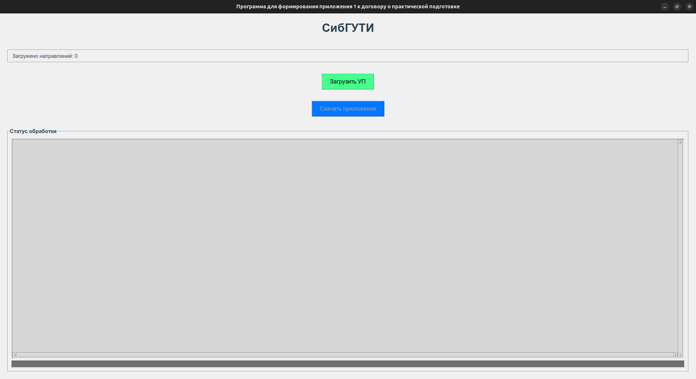
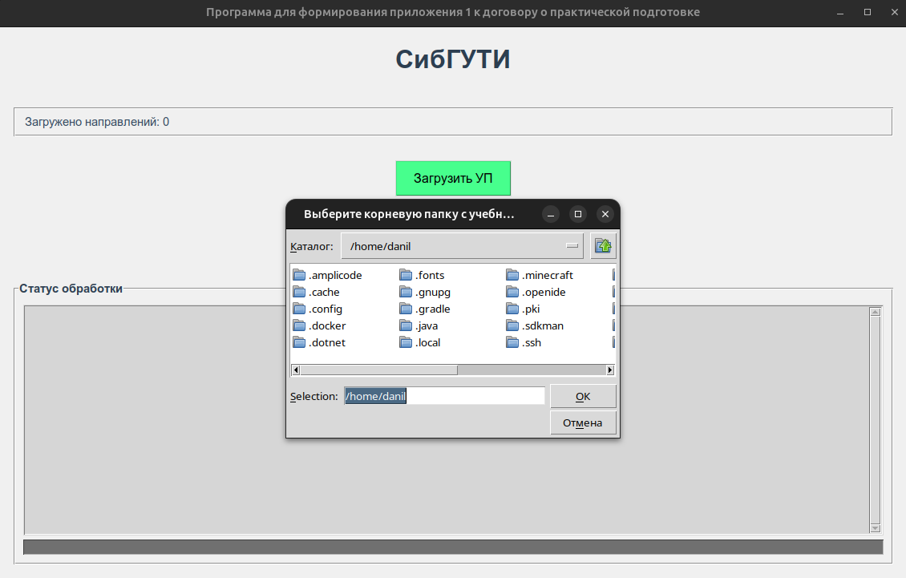
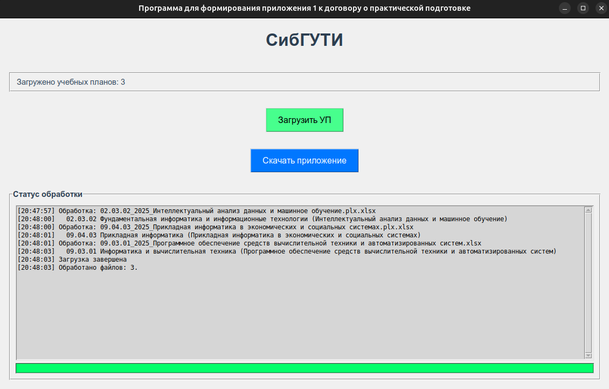
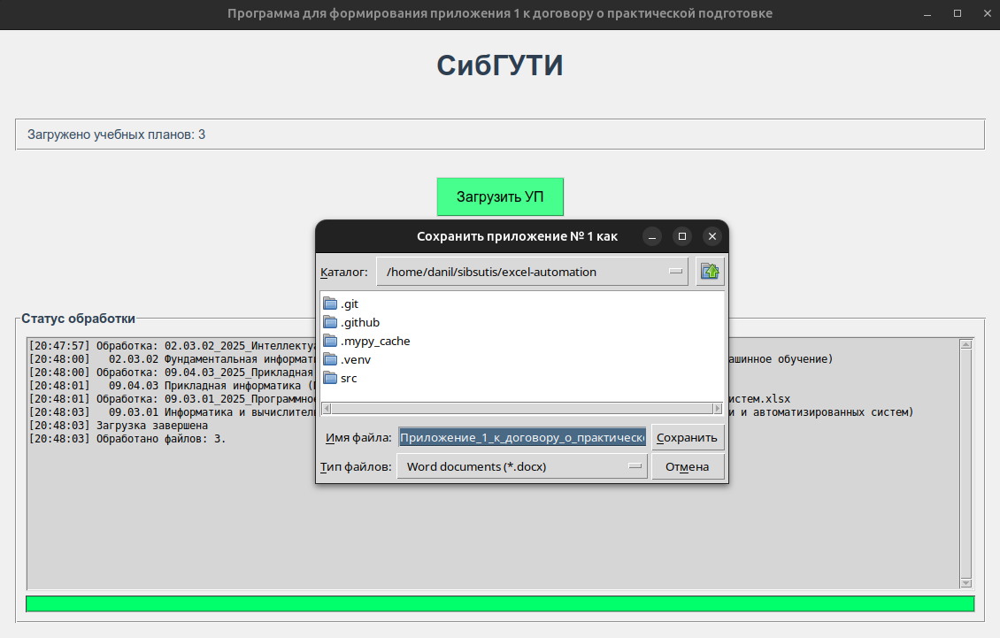
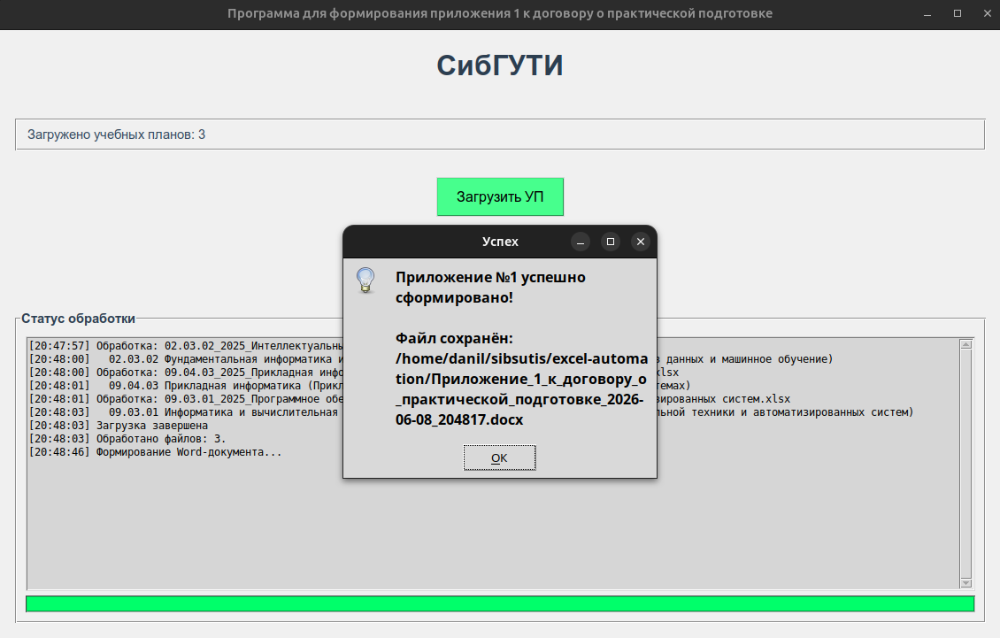
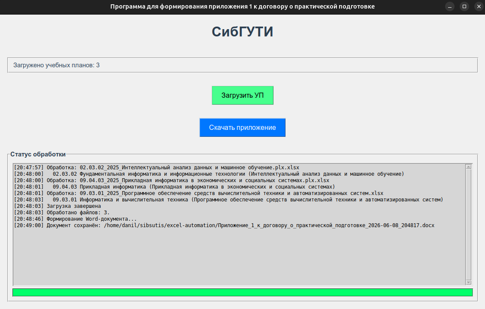
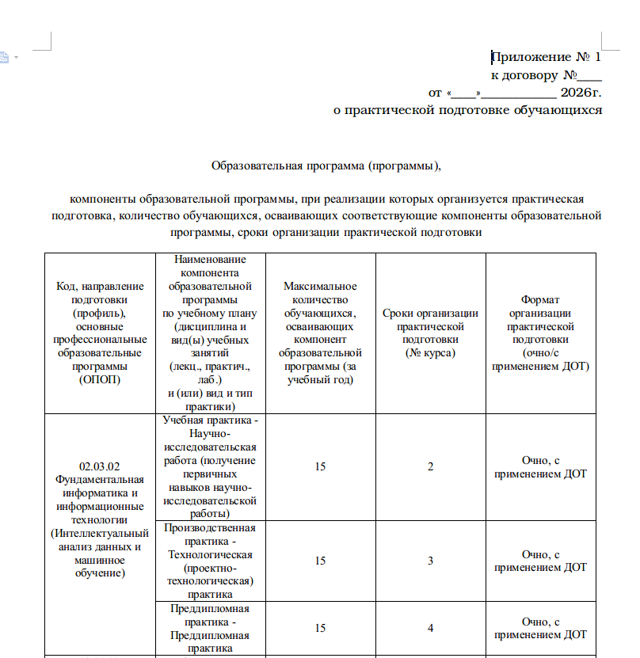
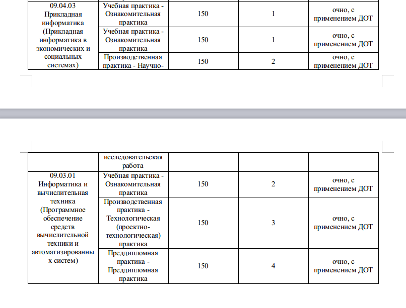
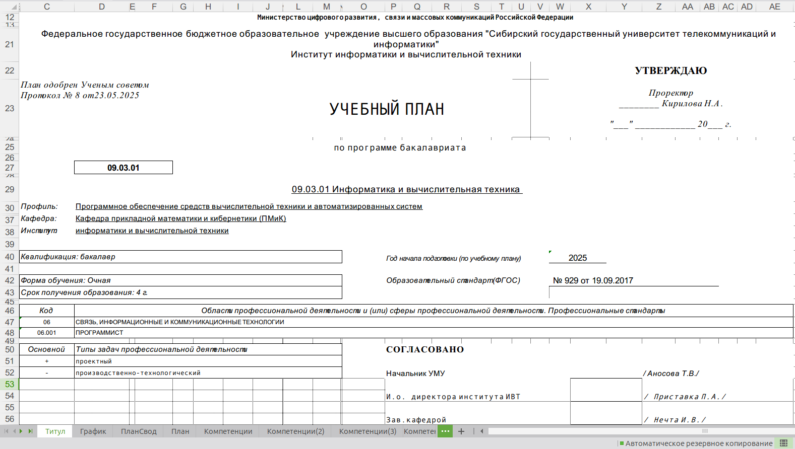
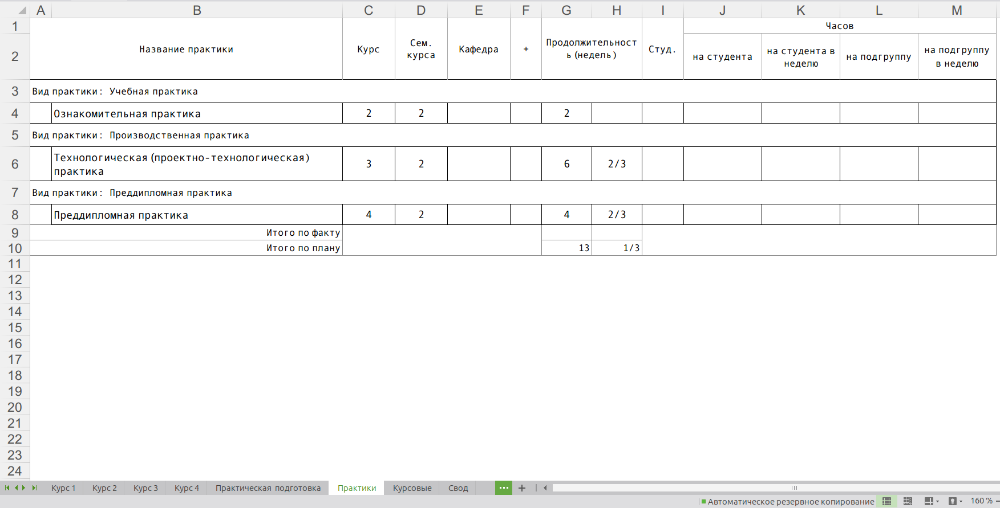

# excel-automation
## Содержание
1. [О проекте](#о-проекте)
2. [Технологический стек](#технологический-стек)
3. [Установка и запуск](#установка-и-запуск)  
3.1. [Для конечных пользователей](#для-конечных-пользователей)  
3.2. [Для разработчиков и тестировщиков](#для-разработчиков-и-тестировщиков)
4. [Использование](#использование)  
4.1. [Скриншоты работы программы](#скриншоты-работы-программы-успешная-обработка-файлов-и-формирование-документа)  
4.2. [Результат выполнения программы](#результат-выполнения-программы-сформированный-документ)  
4.3. [Важные примечания](#важные-примечания)
## О проекте
Десктопная программа, позволяющая автоматизированно формировать приложение № 1 к договору о практической подготовке в формате DOCX из нескольких учебных планов в формате XLSX. Разработана в рамках прохождения производственной практики от Центра Карьеры СибГУТИ.
## Технологический стек
| Зависимость | Версия |
|-|-|
| Python | 3.12.3 |
| UV | 0.11.4 |
| openpyxl | 3.1.5 |
| python-docx | 1.2.0 |
| pyinstaller | 6.20.0 |
| black | 26.5.1 |
| isort | 8.0.1 |
| flake8 | 7.3.0 |
| mypy | 2.1.0 |
## Установка и запуск
### Для конечных пользователей
[На странице релизов](https://github.com/Danil2305A/excel-automation/releases) скачайте архив, соответствующий Вашей ОС, распакуйте его и запустите исполняемый файл.
> Может потребоваться предоставить разрешение на запуск. Система может ложно распознать файл как потенциально вредоносный (в особенности в Windows).
### Для разработчиков и тестировщиков
1. Скачайте и установите Python 3.12 
* Windows: с [официального сайта](https://www.python.org/downloads/).
* Linux (с установкой Tkinter):
```bash
sudo apt update && sudo apt install python3.12 python3.12-venv python3.12-dev python3-tk tk8.6-dev tcl8.6-dev
```
2. Скачайте и установите [пакетный менеджер UV](https://docs.astral.sh/uv/getting-started/installation/)
3. Склонируйте репозиторий или скачайте и распакуйте архив проекта.
4. Перейдите в директорию проекта:
```bash
cd excel-automation
```
5. Создайте виртуальное окружение:
```bash
uv venv
```
6. Активируйте виртуальное окружение:
* Windows:
```bash
venv\Scripts\activate 
```
* Linux:
```bash
source .venv/bin/activate
```
7. Установите дополнительные зависимости проекта:
```bash
uv sync
```
8. Запустите приложение:
```bash
uv run src/main.py
```
## Использование
### Скриншоты работы программы. Успешная обработка файлов и формирование документа






### Результат выполнения программы. Сформированный документ


### Важные примечания
Гарантией успешной обработки данных и корректного формирования документа является правильная разметка содержимого в каждом XLSX-файле:  

1. Наличие листов "Титул" и "Практики". С листа "Титул" считываются код, название специальности и профиль. С листа "Практики" считываются виды практик, конкретные названия практик и соответствующий номер курса.

2. В листе "Титул":

* Код и название специальности должны располагаться целиком в ячейке D29.
* Название профиля должно располагаться целиком в ячейке D30.

3. В листе "Практики":

* Наличие ключевых слов "Название практики" (строка 1), "Вид практики" (столбец А) и "Курс" (строка 1).
* Конкретные названия практик в столбце B (для каждого вида практики их должно быть не менее одного).
* Не должно быть никаких межстроковых пустых промежутков в диапазоне извлечения данных.